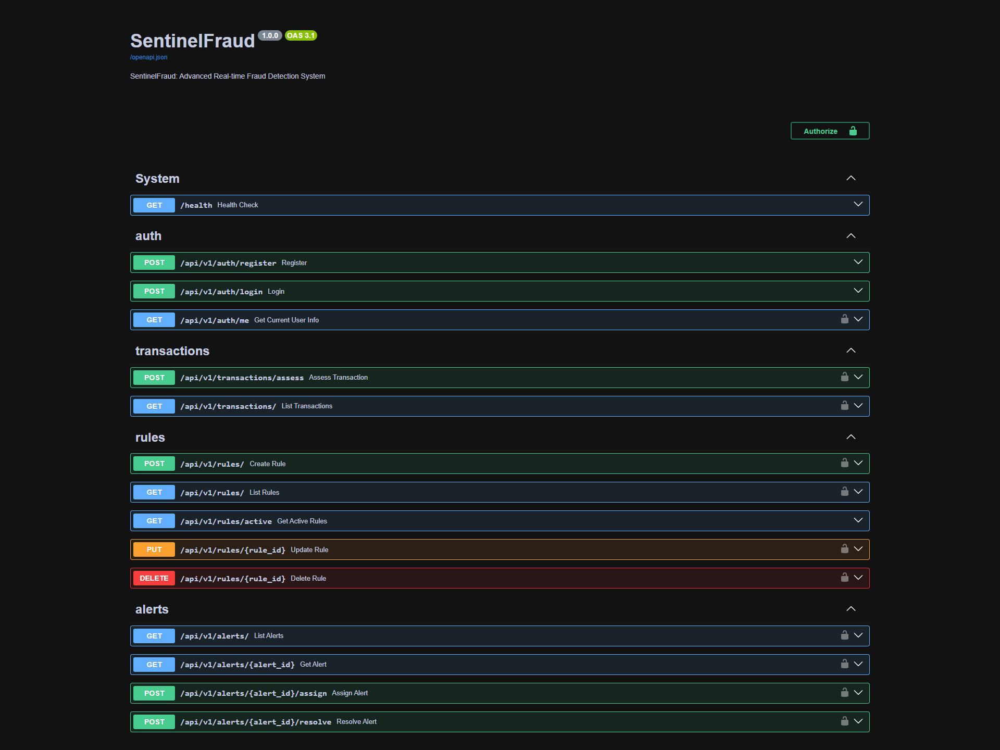

# SentinelFraud

[](https://fastapi.tiangolo.com/)
[](https://www.postgresql.org/)
[](https://redis.io/)
[](https://www.python.org/)
[](https://opensource.org/licenses/MIT)

SentinelFraud is a real time fraud detection service for transaction risk assessment. It combines API-driven rule management, Redis-backed velocity checks, ML assisted scoring, alert workflows, and WebSocket delivery in a single FastAPI-based backend.

## API Preview

The screenshot below shows the Swagger/OpenAPI view for the service endpoints.



## Overview

The service is designed around a straightforward scoring pipeline:

- incoming transactions are submitted to the API
- the risk engine evaluates velocity, amount, geolocation, device, and ML-based signals
- the transaction and scoring outcome are persisted in PostgreSQL
- elevated-risk outcomes generate alerts and optional real-time dashboard notifications

This repository includes the API service, database models, async data access layer, background task wiring, ML training utilities, and an automated test suite.

## Core Capabilities

- Transaction assessment with structured risk decisions: `approve`, `review`, or `decline`
- Configurable fraud rules managed through API endpoints
- Redis-backed velocity checks for user, card, and device activity
- Alert creation, assignment, and resolution workflows
- JWT-based authentication with role-aware access control
- WebSocket notifications for fraud alerts
- Health checks covering both database and Redis connectivity
- Docker-based local deployment and service composition

## Architecture

### Main Components

- `app/api`
  FastAPI routes and request handling
- `app/services`
  Risk engine, alert orchestration, velocity logic, ML scoring, and WebSocket coordination
- `app/repositories`
  Database access abstractions built on async SQLAlchemy
- `app/models`
  SQLAlchemy models for users, transactions, alerts, fraud rules, and ML model metadata
- `app/schemas`
  Pydantic request and response contracts
- `app/tasks`
  Celery application wiring and background task entry points
- `ml`
  Training and feature extraction utilities
- `tests`
  API and integration-oriented test coverage

### Stack

- FastAPI
- SQLAlchemy 2.0 async ORM
- PostgreSQL
- Redis
- Celery
- scikit-learn
- Pydantic v2
- structlog

## Requirements

- Python 3.11 or newer
- PostgreSQL
- Redis

Python 3.11 is the recommended runtime for local development and deployment. The included Docker image also targets Python 3.11.

## Getting Started

### Local Development

1. Clone the repository.

```bash
git clone https://github.com/yourusername/sentinel-fraud.git
cd sentinel-fraud
```

2. Create a virtual environment and install dependencies.

```bash
python -m venv venv
venv\Scripts\activate
pip install -r requirements.txt
```

3. Copy the example environment file.

```bash
copy .env.example .env
```

4. Configure `.env`.

At minimum, set either:

- `DATABASE_URI`

or:

- `POSTGRES_SERVER`
- `POSTGRES_PORT`
- `POSTGRES_USER`
- `POSTGRES_PASSWORD`
- `POSTGRES_DB`

Also configure:

- `SECRET_KEY`
- `REDIS_HOST`
- `REDIS_PORT`

5. Apply database migrations.

```bash
alembic upgrade head
```

6. Start the API.

```bash
uvicorn app.main:app --reload
```

The API will be available at [http://localhost:8000](http://localhost:8000).

### Docker Compose

1. Copy the example environment file.

```bash
copy .env.example .env
```

2. Provide a strong application secret in your shell or environment management system.

```bash
set SECRET_KEY=replace-with-a-long-random-secret
```

3. Start the stack.

```bash
docker-compose -f docker/docker-compose.yml up -d --build
```

## Configuration

Important runtime settings include:

- `ENVIRONMENT`
- `DEBUG`
- `SECRET_KEY`
- `DATABASE_URI`
- `POSTGRES_*`
- `REDIS_HOST`
- `REDIS_PORT`
- `CELERY_BROKER_URL`
- `CELERY_RESULT_BACKEND`
- `BACKEND_CORS_ORIGINS`
- `ALLOWED_HOSTS`
- `ENABLE_DOCS`
- `DB_POOL_SIZE`
- `DB_MAX_OVERFLOW`

See [.env.example](.env.example) for the full list.

## API Surface

The application exposes:

- authentication endpoints under `/api/v1/auth`
- transaction assessment and listing under `/api/v1/transactions`
- fraud rule management under `/api/v1/rules`
- alert operations under `/api/v1/alerts`
- WebSocket alert streaming under `/api/v1/ws/alerts`

Interactive API docs are available locally at:

- [http://localhost:8000/docs](http://localhost:8000/docs)
- [http://localhost:8000/redoc](http://localhost:8000/redoc)

In production, documentation endpoints should typically be disabled by setting `ENABLE_DOCS=false`.

## Operations

### Health Checks

`GET /health` reports:

- application status
- version
- environment
- dependency status for PostgreSQL and Redis

### Security Controls

The service includes:

- JWT authentication for protected routes
- role-based permissions for analyst and admin workflows
- configurable trusted hosts
- configurable CORS origins
- HTTP security headers

### Deployment Guidance

For production deployments:

- inject secrets through your deployment platform rather than committing them to files
- run `alembic upgrade head` as part of deployment
- terminate TLS at a reverse proxy or ingress layer
- restrict `BACKEND_CORS_ORIGINS` and `ALLOWED_HOSTS` to known values
- disable interactive docs unless they are intentionally exposed
- run PostgreSQL and Redis with persistent storage, backups, and monitoring

This repository is production-oriented at the service layer, but safe deployment still depends on infrastructure controls such as TLS, secret management, backups, observability, and network policy.

## Testing

Run the automated test suite with:

```bash
py -3.11 -m pytest -q
```

Current status: the suite passes with `47 passed` on Python 3.11.

## Project Structure

```text
app/
  api/            API routes
  core/           configuration, logging, middleware, security
  db/             engine setup and Alembic migrations
  models/         SQLAlchemy models
  repositories/   data access layer
  schemas/        Pydantic contracts
  services/       business logic
  tasks/          Celery integration
ml/               training and feature utilities
tests/            automated tests
docker/           container definitions
```

## License

This project is distributed under the MIT License.
